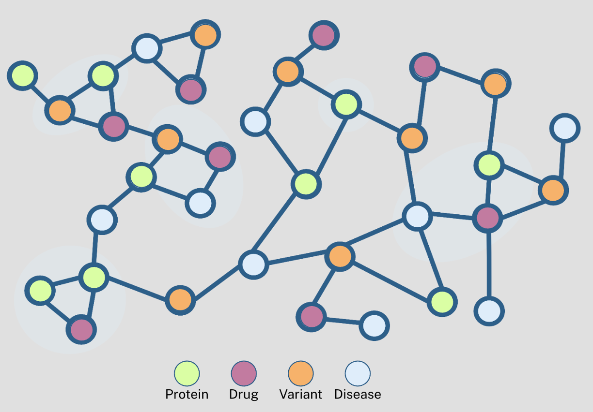

# Overview 

This repository contains code to analyze a network file generated by creating a drug, disease, protein, variant network using data from PharmGKB, Drug Target Commons (DTC), BioPlex and Binding DB. 

* PharmGKB: PharmGKB is a comprehensive pharmacogenomics resource that provides information on how genetic variation influences drug responses, including detailed drug–gene, drug–variant, and drug–disease associations. (Whirl-Carrillo, 2021)

* Drug Target Commons (DTC): Drug Target Commons is a community-driven database offering curated and standardized data on drug–target interactions, including binding affinity measurements and other key metrics for therapeutic targets. (Wishart, 2018)

* BioPlex: BioPlex provides large-scale proteomics data focused on protein–protein interactions, enabling the exploration of the complex networks that underpin cellular function. (Huttlin, 2015)

* Binding DB: Binding DB is a public repository that offers quantitative binding affinity data between proteins and small molecules, particularly useful for analyzing drug efficacy and biochemical interaction profiles. (Gilson, 2015)

Data from these databases were all processed and standardized to standard naming conventions (ie CHEMBL for drugs, and UniProt for proteins) and then combined into a heterogenous network using the python `networkx` package. Binding data between protein and drug (from DTC or Binding DB) when available was incorporated into weighted edges, either in the form of IC50, or Ki, and protein-protein interaction scores (pInt) from BioPlex was also incorporated as a weighted edge. 

# Data

Datasets and premade network file are stored in the `data` folder. Files that are `.tsv` or `.csv` files are raw data directly from the source (ie PharmGKB, or DTC), whereas `.json` files are premade dictionaries mapping entries of a dataset to a common identifier ie UniProt ID or CHEMBL ID. These were generated with separate data processessing scripts. The `network.gpickle` file was generated in python with the `networkx` package as a heterogenous network using data from the dataset files included in the `data` folder, using the `.json` dictionaries to map entries to common identifiers. 

# Installation and Running  
This guide explains how to set up your environment and run the network analysis code for a given network (saved in a .gpickle format)

## 1. Create a new Conda environment
Create a new Conda environment named "network_analysis" 

  ```sh
conda env create -f environment.yml
  ```

## 2. Activate the new environment
  ```sh
conda activate network_analysis
  ```

## 3. Process data files 
Run `scripts/data-processing.py` which will process datasets stored in `data` folder, and generate correct mappings to CHEMBL-IDs by calling web APIs for each database. 
  ```sh
python scripts/data-processing.py 
  ```

## 4. Generate Network 
Run `scripts/build-network.py` which will load the mapping files generated in step 3. and associated datasets, and normalize all to CHEMBL and then generate a heterogenous network, cross referencing databases to unify overlapping entities. Edges are added and weighted based on interaction score between elements (ex. IC50 for drug-protein interaction and pInt score for protein-protein interaction). This script will generate a file called `network.gpickle` which can then be reloaded if the network needs ot be examined. 
  ```sh
python scripts/build-network.py 
  ```
## 5. Graph Network Elements 
(Optional) To graph network statistics, ie number of nodes and edges, and contributions from each database, run  `scripts/graph-network.py` with the path of the network. The script will generate basic graph statistics, a plot of node counts by type, an plot of edge relation counts, and a heatmap of pairwise overlap between datasets. 

  ```sh
python scripts/graph-network.py network.gpickle 
  ```
## 6. Setup GNN Training Parameters 
Run `scripts/setup-training-network.py` to generate files needed to train the network as a GNN with a SIGN based encoder. The path to the network can be changed in the script (Line 30). The script will reload the graph from the pickle file, generate node features for each type of node, with 1224-d for a drug, 1280-d for a protein, 128-d for a variant and 512-d for a disease. All vectors are then padded to 1280. The adjaceny matrices for SIGN are precomputed for K = 1,2,3 hops and saved as a gpickle file, `A_sparse_and_K.gpickle`. The training and testing split are also generated in an 80-20 split with random nodes and edges split into each. Each set is also saved to a .gpickle file `train_data.gpickle` and `test_data.gpickle`. 

  ```sh
python scripts/setup-training-network.py
  ```
## 7. Train the GNN 
Run `scripts/train-network.py` to train the GNN based on precomputed training parameters and preconstructed network. The heterogenous graph is reloaded as are the precomputed adjacency matrix and training/test set. The model is trianed for 50 epochs with cross entropy loss and AdamW optimizer. The learning rate starts at 1e-5, but has a weight_decay of 1e-2. After each epoch, the model checkpoint is saved to a generated folder `checkpoints`, with the name `ckpt_epoch_{epoch}.pth`. All training metrics and statistics are then saved to `training_metrics.pkl`. 
  ```sh
python scripts/train-network.py
  ```

## 8. Graph Training Statistics 
Run `scripts/graph-trained-eval.py` to visualize training statistics from `training_metrics.pkl` file saved out after training. The script will generate a panel of graphs that include the ROC and Precision-Recall curves per class and macro, the confusion matrix, a UMAP projection, the Precision@K and Calibration Curve for the trianing.  This panel is saved as `evaluation_panel.png`
  ```sh
python scripts/graph-trained-eval.py
  ```


# Citations 
Wishart, D. S., Feunang, Y. D., Guo, A. C., Lo, E. J., Marcu, A., Grant, J. R., ... & Wilson, M. (2018). DrugBank 5.0: a major update to the DrugBank database for 2018. Nucleic Acids Research, 46(D1), D1074-D1082.

Gilson, M. K., Liu, T., Baitaluk, M., Nicola, G., Hwang, L., & Chong, J. (2016). BindingDB in 2015: A public database for medicinal chemistry, computational chemistry and systems pharmacology. Nucleic Acids Research, 44(D1), D1045-D1053.

Whirl-Carrillo, M., Huddart, R., Gong, L., Sangkuhl, K., Thorn, C. F., Whaley, R., & Klein, T. E. (2021). An evidence-based framework for evaluating pharmacogenomics knowledge for personalized medicine. Clinical Pharmacology & Therapeutics, 110(3), 563-572.

Huttlin EL, Ting L, Bruckner RJ, Gebreab F, Gygi MP, Szpyt J, Tam S, Zarraga G, Colby G, Baltier K, Dong R, Guarani V, Vaites LP, Ordureau A, Rad R, Erickson BK, Wühr M, Chick J, Zhai B, Kolippakkam D, Mintseris J, Obar RA, Harris T, Artavanis-Tsakonas S, Sowa ME, De Camilli P, Paulo JA, Harper JW, Gygi SP. The BioPlex Network: A Systematic Exploration of the Human Interactome. Cell. 2015 Jul 16;162(2):425-440. doi: 10.1016/j.cell.2015.06.043. PMID: 26186194; PMCID: PMC4617211.
